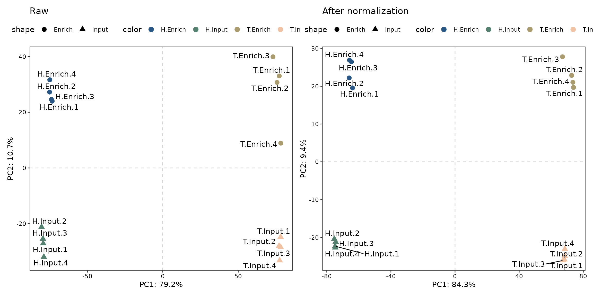
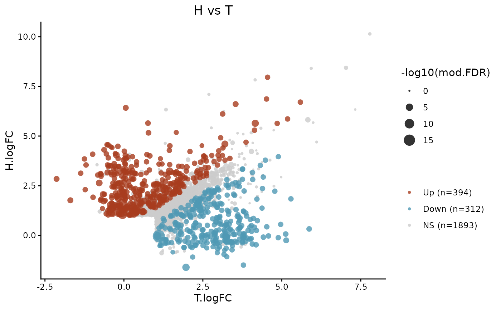

# Tutorial

## Introduction

`Gretool` package is implemented in R and publicly available at
<https://github.com/thereallda/Gretool>.

## Setup

For this tutorial, we will demonstrate the `Gretool` workflow by using a
glyco-capped RNA-seq data from human.

We start by reading in the data, including count matrix and metadata.
The metadata requires at lease two columns:

1\. The *condition* column specifies the biological group of each
sample, such as **A.Input**, indicating that the sample is an input
sample from biological condition A.

2\. The *enrich* column denotes the enrichment group of each sample,
such as **Input**, representing the input library.

``` r
library(Gretool)
library(dplyr)
library(ggplot2)
library(tidyr)
library(patchwork)

# read in metadata and counts matrix
counts_mat <- read.csv("data/Counts.csv", row.names = 1)
meta <- read.csv("data/metadata.csv", comment.char = "#")
head(meta)
#>         id sample.id condition enrich replicate
#> 1 H.input1  H.input1   H.Input  Input         1
#> 2 H.input2  H.input2   H.Input  Input         2
#> 3 H.input3  H.input3   H.Input  Input         3
#> 4 H.input4  H.input4   H.Input  Input         4
#> 5    H.ip1     H.ip1  H.Enrich Enrich         1
#> 6    H.ip2     H.ip2  H.Enrich Enrich         2
# rownames of metadata should be consistent with the colnames of counts_mat
rownames(meta) <- meta$id
```

Also, other information, such as batch group can be included in the
metadata.

Next, we use the count matrix and metadata to create a `Gretool` object.

The `Gretool` object serves as a container that contains both data (raw
and normalized counts data) and analysis (e.g., normalization
performance evaluation score and enrichment results).

When constructing `Gretool` object, we can provide following arguments:

- The id of input (`input.id = "Input"`) and enrichment
  (`enrich.id = "Enrich"`), same as the enrich column in the metadata
  (**required**).

- Prefix of spike-in genes (`spike.in.prefix = "^FB"`) (optional);

- The id of synthetic spike-in (`synthetic.id = c("Syn1", "Syn2")`),
  same with row names in `counts_mat` (optional);

``` r
# create object
Gretool <- createGretool(data = counts_mat,
                         col.data = meta,
                         input.id = "Input",
                         enrich.id = "Enrich"
                         )
Gretool
#> class: Gretool 
#> dim: 62700 16 
#> metadata(0):
#> assays(1): ''
#> rownames(62700): ENSG00000279928 ENSG00000228037 ... ENSG00000210195
#>   ENSG00000210196
#> rowData names(3): GeneID SpikeIn Synthetic
#> colnames(16): H.input1 H.input2 ... T.ip3 T.ip4
#> colData names(7): id id.1 ... replicate batch
```

## Quick start

`Gretool` starts with quality control step to filter lowly-expressed
genes. This step is performed with `FilterLowExprGene` by keeping genes
with at least `min.count` in at least n samples. n is determined by the
smallest group sample size specifying in `group` .

``` r
Gretool <- FilterLowExprGene(Gretool, group = Gretool$condition, min.count = 10)
Gretool
#> class: Gretool 
#> dim: 15832 16 
#> metadata(0):
#> assays(1): ''
#> rownames(15832): ENSG00000142611 ENSG00000157911 ... ENSG00000210195
#>   ENSG00000210196
#> rowData names(3): GeneID SpikeIn Synthetic
#> colnames(16): H.input1 H.input2 ... T.ip3 T.ip4
#> colData names(7): id id.1 ... replicate batch
```

### Normalization and assessment

The main `Gretool` function can be used to perform gene selection,
normalization, and evaluation. This function return selected gene set in
`rowData`, normalized count matrix in `counts` slot (when
`return.norm=TRUE`), normalization factors (`norm_factors` slot),
evaluation metrics and scores in `norm_metrics` and `norm_scores` slots,
respectively. Detailed of these steps are described bellow.

``` r
Gretool <- Gretool(Gretool, 
               scaling.method = c( "TMM", "DESeq"),
               ruv.norm = TRUE, ruv.k = 3,
               eval.pam.k = 2:3, eval.pc.n = 3, 
               return.norm = TRUE
               )
#> Gene set selection for normalization and assessment...
#> - The number of negative control genes for normalization: 1000 
#> - Estimate dispersion & Fit GLM... 
#> - Testing differential genes... 
#> - The number of positive evaluation genes: 500 
#> - Estimate dispersion & Fit GLM... 
#> - Testing differential genes... 
#> - The number of negative evaluation genes: 500 
#> - Estimate dispersion & Fit GLM... 
#> - Testing differential genes... 
#> Apply normalization...
#> - Scaling... 
#> - Regression-based normalization... 
#> Perform assessment...
```

## Effect of normalization

Here, we use the top-ranked procedure DESeq_RUVs_k3 for downstream
analysis.

We perform PCA based on the count matrix from sample of interest before
and after the normalization, for demonstrating the effect of
normalization.

``` r
# get scores for normalization
norm_scores <- getScore(Gretool)

head(norm_scores)
#>               BIO_SIM EN_SIM BATCH_SIM PAM_SIM RLE_MED RLE_IQR WV_COR UV_COR
#> DESeq_RUVs_k3      28     29         1      29      30      14     26     28
#> TMM_RUVs_k3        29     28         1      28      29      15     27     27
#> Raw_RUVs_k3        30     30         1      30       7      30     22     15
#> DESeq_RUVs_k2      27     22         1      27      28       8     23     16
#> TMM_RUVs_k2        26     19         1      26      27      13     20     11
#> TMM_RUVs_k1        23     14         1      20      24      25      9     20
#>                  SCORE
#> DESeq_RUVs_k3 26.28571
#> TMM_RUVs_k3   26.14286
#> Raw_RUVs_k3   23.42857
#> DESeq_RUVs_k2 21.57143
#> TMM_RUVs_k2   20.28571
#> TMM_RUVs_k1   19.28571

# select normalization
norm_method <- rownames(norm_scores[1,])

# get normalized counts
norm_data <- Gretool::Counts(Gretool, slot = "sample", method = norm_method)

# get normalization factors
norm_factors <- getFactor(Gretool, slot = "sample", method = norm_method)

# create sample name, e.g., A.Input.1
samples_name <- paste(Gretool$condition, Gretool$replicate, sep=".")

# PCA for raw count
p1 <- PCAplot(Gretool::Counts(Gretool, slot="sample", "Raw"), 
            color = Gretool$condition,
            shape = Gretool$enrich,
            label = samples_name, 
            vst.norm = TRUE) + 
  ggtitle("Raw")
#> Warning: `aes_string()` was deprecated in ggplot2 3.0.0.
#> ℹ Please use tidy evaluation idioms with `aes()`.
#> ℹ See also `vignette("ggplot2-in-packages")` for more information.
#> ℹ The deprecated feature was likely used in the Gretool package.
#>   Please report the issue to the authors.
#> This warning is displayed once every 8 hours.
#> Call `lifecycle::last_lifecycle_warnings()` to see where this warning was
#> generated.

# PCA for normalized count
p2 <- PCAplot(log1p(norm_data), 
            color = Gretool$condition,
            shape = Gretool$enrich,
            label = samples_name, 
            vst.norm = FALSE) + 
  ggtitle("After normalization")

# combine two plots
p1 + p2
```



## Find enrichment

`Gretool` package can help you find enrichment genes from each
biological groups via differential expression. It can identify genes
that significantly increased in enrichment samples compared to input
samples.

`FindEnrichment` automates this processes for all groups provided in
`condition` column.

By default, enriched genes are defined as fold change of normalized
transcript counts ≥ 2 (`logfc.cutoff = 1`), FDR \< 0.05
(`p.cutoff = 0.05`) in enrichment samples compared to those in input
samples.

Use `getEnrichment` to retrieve a list of enrichment result tables.

``` r
# find all enriched genes
Gretool <- FindEnrichment(Gretool, 
                          slot="sample", 
                          norm.method = norm_method, 
                          logfc.cutoff = 1, 
                          p.cutoff = 0.05)
#> - Estimate dispersion & Fit GLM... 
#> - Testing differential genes...

# get filtered enrichment results
res.sig.ls <- getEnrichment(Gretool, slot="sample", filter=TRUE)
names(res.sig.ls) <- c('H','T')
# count number of enrichment in each group
unlist(lapply(res.sig.ls, nrow))
#>    H    T 
#> 1924 2023
```

Each enrichment table is a `data.frame` with a list of genes as rows,
and associated information as columns (GeneID, logFC, p-values, etc.).
The following columns are present in the table:

- `GeneID`: ID of genes.
- `logFC`: log2 fold-change between enrichment and input samples.
  Positive values indicate that the gene is more highly enriched in the
  enrichment group.
- `logCPM`: log2 CPM (counts per million) of the average expression of
  all samples.
- `LR`: Likelihood ratio of the likelihood ratio test.
- `PValue`: p-value from the likelihood ratio test.
- `FDR`: False discovery rate of the p-value, default “BH” method is
  applied.

## Differential modification analysis

You can perform differential modification analysis with
`DiffModification`

``` r
# create biological column in metadata
meta$bio <- gsub('\\..*','',meta$condition)
meta
#>                id sample.id condition enrich replicate bio
#> H.input1 H.input1  H.input1   H.Input  Input         1   H
#> H.input2 H.input2  H.input2   H.Input  Input         2   H
#> H.input3 H.input3  H.input3   H.Input  Input         3   H
#> H.input4 H.input4  H.input4   H.Input  Input         4   H
#> H.ip1       H.ip1     H.ip1  H.Enrich Enrich         1   H
#> H.ip2       H.ip2     H.ip2  H.Enrich Enrich         2   H
#> H.ip3       H.ip3     H.ip3  H.Enrich Enrich         3   H
#> H.ip4       H.ip4     H.ip4  H.Enrich Enrich         4   H
#> T.input1 T.input1  T.input1   T.Input  Input         1   T
#> T.input2 T.input2  T.input2   T.Input  Input         2   T
#> T.input3 T.input3  T.input3   T.Input  Input         3   T
#> T.input4 T.input4  T.input4   T.Input  Input         4   T
#> T.ip1       T.ip1     T.ip1  T.Enrich Enrich         1   T
#> T.ip2       T.ip2     T.ip2  T.Enrich Enrich         2   T
#> T.ip3       T.ip3     T.ip3  T.Enrich Enrich         3   T
#> T.ip4       T.ip4     T.ip4  T.Enrich Enrich         4   T

# testing 
diff_mod <- DiffModification(
  Gretool,
  norm.method = norm_method,
  col.data = meta,
  contrast.df = data.frame(Group1=c('H'), 
                           Group2=c('T')),
  assay.colname = 'enrich',
  biology.colname = 'bio',
  input.id = 'Input',
  enrich.id = 'Enrich',
  eps = 1e-4,
  shrink_lambda = 0
)
#> - Estimate dispersion & Fit GLM... 
#> - Testing differential genes...

head(diff_mod[[1]])
#>            GeneID  H.logFC         H.FDR  T.logFC        T.FDR        LR
#> 1 ENSG00000210196 3.369089 5.975863e-167 2.400430 3.665593e-92 1.8006983
#> 4 ENSG00000212402 8.407736  4.578186e-89 5.930855 3.613089e-50 0.8825648
#> 5 ENSG00000263934 3.226858  1.271129e-87 3.001821 3.209291e-81 2.4853247
#> 6 ENSG00000136159 2.221450  5.022980e-81 2.249885 2.194611e-89 0.6462647
#> 7 ENSG00000198786 2.528707  2.740577e-79 2.228075 1.809955e-62 0.1451544
#> 8 ENSG00000173214 1.661057  9.826775e-73 1.726249 5.285824e-65 0.9099521
#>      PValue   mod.FDR  logFC.diff mod.type
#> 1 0.1796281 0.4170512  0.96865947       NS
#> 4 0.3475002 0.5457629  2.47688160       NS
#> 5 0.1149126 0.3478914  0.22503734       NS
#> 6 0.4214513 0.5947956 -0.02843545       NS
#> 7 0.7032096 0.7958550  0.30063236       NS
#> 8 0.3401271 0.5406134 -0.06519206       NS
```

By default, `DiffModification` output all differential modification
results for all genes. You can subset the table based on the enriched
genes from `FindEnrichment`

``` r
enrich_ids <- unique(unlist(lapply(res.sig.ls, function(x) x$GeneID)))

diff_mod_enrich <- subset(diff_mod[[1]], GeneID %in% enrich_ids)
dim(diff_mod_enrich)
#> [1] 2599   10
```

You can visualize the differential results with scatter plot

``` r
typedf1 <- data.frame(table(diff_mod_enrich$mod.type)) %>%
  mutate(label = paste0(Var1,' (n=',Freq,')'),
         prop = round(100*Freq/sum(Freq),1))

ggplot(diff_mod_enrich, aes(T.logFC,H.logFC, color=mod.type)) +
  geom_point(aes(size = -log10(mod.FDR)), alpha=0.8, shape=16, stroke=NA) +
  theme_classic() +
  theme(legend.position = 'right',
        axis.text = element_text(color='black'),
        plot.title = element_text(hjust=0.5))+
  scale_color_manual(values=c("#A83C1E","#4F99B4","grey80"),
                     labels=typedf1$label) +
  labs(color='', 
       title='H vs T')
```



## Session Info

**Session Info**

``` r
sessionInfo()
#> R version 4.5.2 (2025-10-31)
#> Platform: x86_64-pc-linux-gnu
#> Running under: Ubuntu 24.04.3 LTS
#> 
#> Matrix products: default
#> BLAS:   /usr/lib/x86_64-linux-gnu/openblas-pthread/libblas.so.3 
#> LAPACK: /usr/lib/x86_64-linux-gnu/openblas-pthread/libopenblasp-r0.3.26.so;  LAPACK version 3.12.0
#> 
#> locale:
#>  [1] LC_CTYPE=C.UTF-8       LC_NUMERIC=C           LC_TIME=C.UTF-8       
#>  [4] LC_COLLATE=C.UTF-8     LC_MONETARY=C.UTF-8    LC_MESSAGES=C.UTF-8   
#>  [7] LC_PAPER=C.UTF-8       LC_NAME=C              LC_ADDRESS=C          
#> [10] LC_TELEPHONE=C         LC_MEASUREMENT=C.UTF-8 LC_IDENTIFICATION=C   
#> 
#> time zone: UTC
#> tzcode source: system (glibc)
#> 
#> attached base packages:
#> [1] stats     graphics  grDevices utils     datasets  methods   base     
#> 
#> other attached packages:
#> [1] patchwork_1.3.2 tidyr_1.3.2     ggplot2_4.0.1   dplyr_1.1.4    
#> [5] Gretool_1.0.0  
#> 
#> loaded via a namespace (and not attached):
#>   [1] pbapply_1.7-4               rlang_1.1.6                
#>   [3] magrittr_2.0.4              otel_0.2.0                 
#>   [5] matrixStats_1.5.0           compiler_4.5.2             
#>   [7] flexmix_2.3-20              systemfonts_1.3.1          
#>   [9] vctrs_0.6.5                 stringr_1.6.0              
#>  [11] pkgconfig_2.0.3             fastmap_1.2.0              
#>  [13] backports_1.5.0             XVector_0.50.0             
#>  [15] labeling_0.4.3              rmarkdown_2.30             
#>  [17] ragg_1.5.0                  purrr_1.2.0                
#>  [19] xfun_0.55                   modeltools_0.2-24          
#>  [21] cachem_1.1.0                jsonlite_2.0.0             
#>  [23] EnvStats_3.1.0              DelayedArray_0.36.0        
#>  [25] fpc_2.2-13                  BiocParallel_1.44.0        
#>  [27] broom_1.0.11                parallel_4.5.2             
#>  [29] prabclus_2.3-4              cluster_2.1.8.1            
#>  [31] R6_2.6.1                    bslib_0.9.0                
#>  [33] stringi_1.8.7               RColorBrewer_1.1-3         
#>  [35] limma_3.66.0                car_3.1-3                  
#>  [37] GenomicRanges_1.62.1        jquerylib_0.1.4            
#>  [39] diptest_0.77-2              Rcpp_1.1.0                 
#>  [41] Seqinfo_1.0.0               SummarizedExperiment_1.40.0
#>  [43] knitr_1.51                  IRanges_2.44.0             
#>  [45] Matrix_1.7-4                nnet_7.3-20                
#>  [47] tidyselect_1.2.1            abind_1.4-8                
#>  [49] yaml_2.3.12                 codetools_0.2-20           
#>  [51] lattice_0.22-7              tibble_3.3.0               
#>  [53] Biobase_2.70.0              withr_3.0.2                
#>  [55] S7_0.2.1                    evaluate_1.0.5             
#>  [57] desc_1.4.3                  mclust_6.1.2               
#>  [59] kernlab_0.9-33              pillar_1.11.1              
#>  [61] ggpubr_0.6.2                MatrixGenerics_1.22.0      
#>  [63] carData_3.0-5               stats4_4.5.2               
#>  [65] plotly_4.11.0               generics_0.1.4             
#>  [67] S4Vectors_0.48.0            scales_1.4.0               
#>  [69] class_7.3-23                glue_1.8.0                 
#>  [71] lazyeval_0.2.2              tools_4.5.2                
#>  [73] robustbase_0.99-6           data.table_1.18.0          
#>  [75] locfit_1.5-9.12             ggsignif_0.6.4             
#>  [77] fs_1.6.6                    grid_4.5.2                 
#>  [79] edgeR_4.8.2                 Formula_1.2-5              
#>  [81] cli_3.6.5                   textshaping_1.0.4          
#>  [83] S4Arrays_1.10.1             viridisLite_0.4.2          
#>  [85] paintingr_0.1.0             gtable_0.3.6               
#>  [87] DEoptimR_1.1-4              rstatix_0.7.3              
#>  [89] DESeq2_1.50.2               sass_0.4.10                
#>  [91] digest_0.6.39               BiocGenerics_0.56.0        
#>  [93] SparseArray_1.10.8          ggrepel_0.9.6              
#>  [95] htmlwidgets_1.6.4           farver_2.1.2               
#>  [97] htmltools_0.5.9             pkgdown_2.2.0              
#>  [99] lifecycle_1.0.4             httr_1.4.7                 
#> [101] statmod_1.5.1               MASS_7.3-65
```
